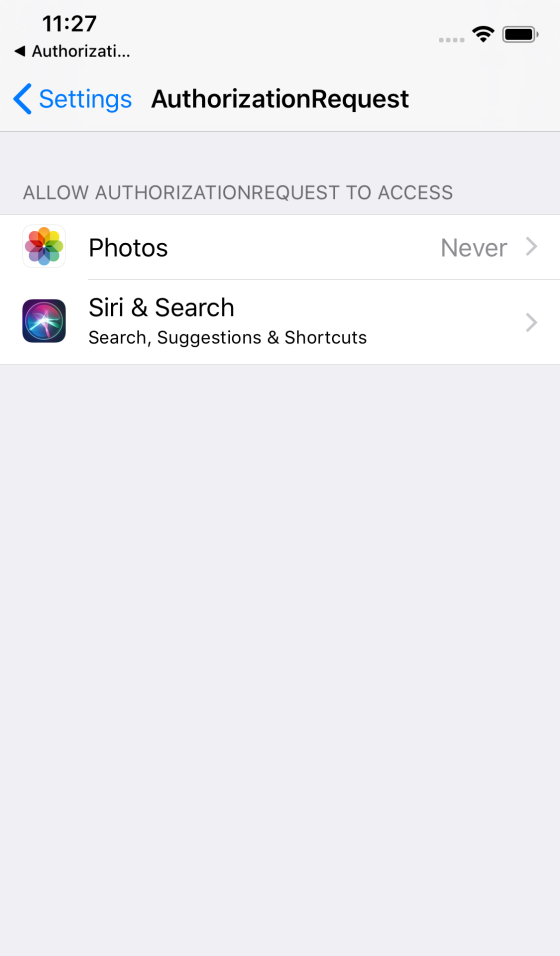

# AuthorizationRequest

A Sample iOS Project of Authorization Request.

## Code

[`ViewController.checkAuthorization(sender:)`](./AuthorizationRequest/ViewController.swift) method checks authorization status and requests authorization.

## Screenshots

|1. If "Don't Allow" is selected, then &rarr; |2. This app requests authorization. If "Settings" is selected, then &rarr; |3. Settings appears and user can authorize it!
|---------------------------------------------|---|---
| | |

## License

MIT © [hahnah](https://superhahnah.com)