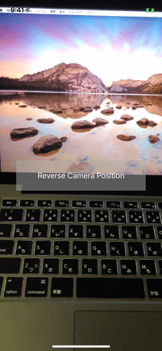

# CameraPositionChange

A Sample iOS Project of camera position changing with horizontal flip animation.

## Screen Capture

## Related To

+ [AVCaptureSession](https://developer.apple.com/documentation/avfoundation/avcapturesession/)
+ [UIView.transition(with:duration:options:animations:completion:)](https://developer.apple.com/documentation/uikit/uiview/1622574-transition)
+ [UIView.AnimationOptions](https://developer.apple.com/documentation/uikit/uiview/animationoptions)

## More Info

[See my blog post (Japanese).](https://superhahnah.com/swift-camera-position-switching/)

## License

MIT © [hahnah](https://superhahnah.com)
