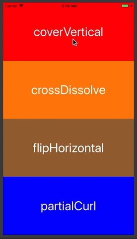

# Example of Modal Transition Styles

There are four styles of modal transition as built-in.

+ coverVertical
+ crossDissolve
+ flipHorizontal
+ partialCurl



Example code to set the modal transition style to `coverVertical` :

```swift
destinationViewController.modalTransitionStyle = UIModalTransitionStyle.coverVertical
```

## License

MIT © [hahnah](https://superhahnah.com)